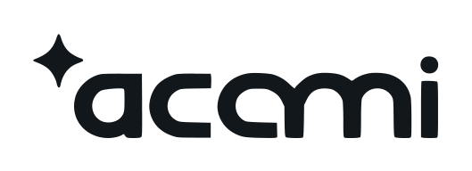
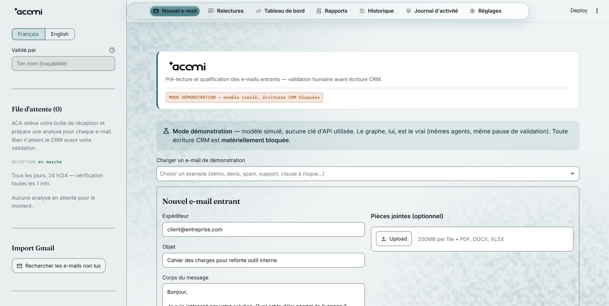
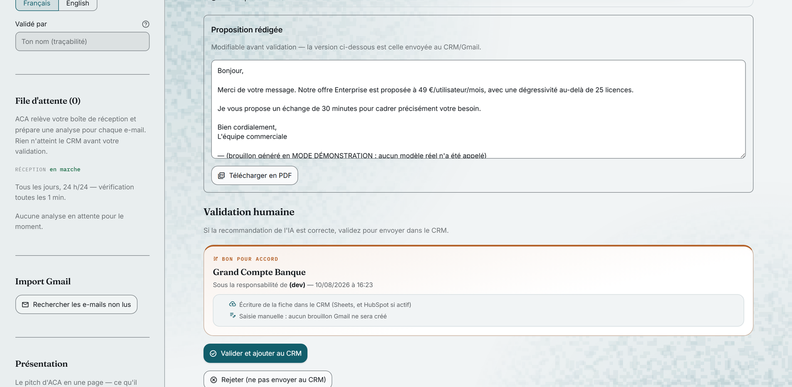
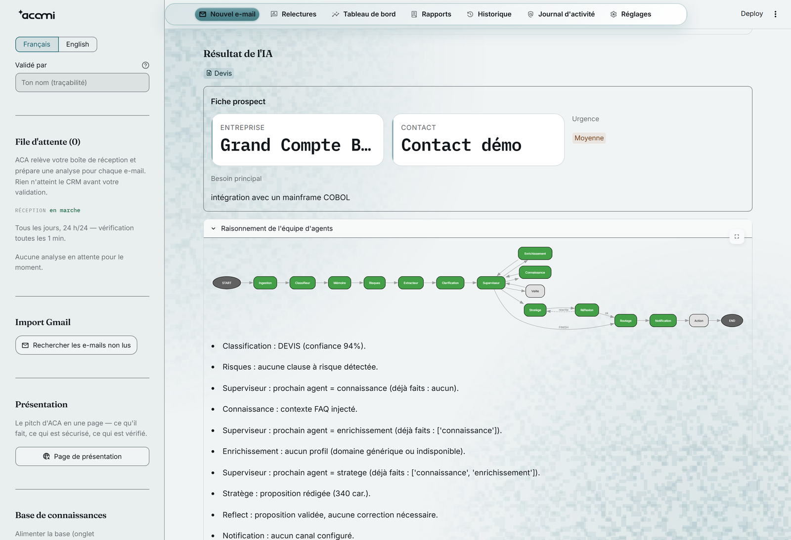

<p align="center">
  <picture>
    <source media="(prefers-color-scheme: dark)" srcset="static/brand/acami-lockup-dark.png">
    
  </picture>
</p>

<h1 align="center">ACA — Agentic Commercial Assistant</h1>

<p align="center">
  A multi-agent LangGraph system that pre-reads incoming sales e-mails, qualifies the lead,<br>
  drafts a proposal — and <b>stops</b> until a human clicks "Validate".
</p>

<p align="center">
  
  
  
  <a href="https://github.com/trulyismail/agentic-commercial-assistant-ACA/actions/workflows/ci.yml"></a>
  
  
</p>

---

ACA pre-reads incoming e-mails and their attachments (PDF, Word, Excel), extracts the lead's
information, checks a knowledge base, enriches the company profile, and drafts a reply — then
**stops**. Nothing is written to the CRM and no e-mail is sent until a human has reviewed and
clicked "Validate". It is a drafting assistant, not an autonomous agent on your CRM — that
boundary is enforced in code (`interrupt_before=["action"]`), not by prompt instructions.

Built solo as an 8-week internship project (Teamwill Tunisia, summer 2026), and since extended
into **acami**, a small agency offer built around the same engine (§ [The acami layer](#the-acami-layer)
below).

## Screenshots

<table>
<tr>
<td width="50%">

**Intake — new e-mail**
<br>Demo mode: no API key, real graph, CRM writes hard-blocked.



</td>
<td width="50%">

**Human validation gate**
<br>Editable draft, then an explicit sign-off before anything reaches the CRM.



</td>
</tr>
</table>

**Live agent trace** — the graph rendered below is not a diagram drawn for this README, it is
the *actual compiled LangGraph topology*, exported at runtime
([`graph_topology.py`](aca/core/graph_topology.py)), with the reasoning log each node produced on
this run:



## Two deployment tiers — n8n is optional

| Tier | Components | For |
|---|---|---|
| **Solo** | API + UI + poller + scheduler | A single consultant, an SME, a demo. **End-to-end automated, no n8n.** |
| **Enterprise** | same **+ n8n** | Orchestration with your other tools (CRM, ERP, ticketing) |

```bash
docker compose --profile solo up          # without n8n
docker compose --profile enterprise up    # with n8n
```

Solo is **not** a crippled "buttons only" mode: `poller.py` ingests Gmail and runs the graph 24/7
even with the UI closed, `scheduler.py` fires follow-ups and GDPR purges on a schedule. **n8n
doesn't add automation — it adds cross-system orchestration.** Both tiers run the same image and
the same API; n8n is one word in a Docker Compose flag.

| Capability | Solo tier | Enterprise tier |
|---|---|---|
| E-mail ingestion | `poller.py` | Gmail Trigger node |
| Passive 24/7 processing | `poller.py` | webhook-triggered workflow |
| GDPR retention sweep | `scheduler.py` | Schedule node |
| Queue maintenance | `scheduler.py` | Schedule node |
| Sales follow-ups | `scheduler.py` | Schedule node |

Integration details: [n8n/README.md](n8n/README.md).

## Quick start

```bash
python -m venv venv && venv\Scripts\activate     # Windows; source venv/bin/activate elsewhere
pip install -r requirements.txt
cp .env.example .env                             # fill in GROQ_API_KEY + GOOGLE_SHEETS_ID
python scripts/setup_sheets.py                   # creates the Leads tab header (once)
python scripts/setup_faq.py                      # seeds the FAQ: 74 Q/A pairs (once)
python scripts/run_solo.py                       # API + UI + poller + scheduler
```

UI at <http://localhost:8501>, API at <http://localhost:8000> (health check: `/health`).

The **strict minimum** is `GROQ_API_KEY` + a Google Sheet. Everything else is optional — a missing
variable means "feature skipped", never a crash. All 68 variables are documented one by one in
[.env.example](.env.example).

**Try it with zero configuration** — runs the graph on 6 demo e-mails and stops at validation,
**never writing to a CRM**:

```bash
python -m aca.core.app
```

Or, for the full UI with no API key at all: set `ACA_DEMO_MODE=1` and run `streamlit run ui.py` —
same graph, same supervisor, same self-critique, same validation pause; only the LLM calls are
simulated. This is exactly how the screenshots above were produced.

## Architecture

A supervisor-and-worker multi-agent graph, compiled with `interrupt_before=["action"]` and a
`RetryPolicy` on every node that calls an external API:

```mermaid
flowchart LR
    START((START)) --> ingestion[Ingestion]
    ingestion --> classifier[Classifier<br/><sub>8B, confidence score</sub>]
    classifier --> memory[Memory Lookup]
    memory --> risk[Risk Scan<br/><sub>deterministic regex</sub>]
    risk --> extractor[Extractor<br/><sub>70B, structured output</sub>]
    extractor -.->|ambiguous need| clarify{{"❓ Clarification<br/>dynamic interrupt"}}
    clarify --> supervisor{{Supervisor<br/>8B}}
    extractor --> supervisor

    supervisor -->|pick next| enrichment[Enrichment<br/><sub>Tavily + Sheets cache</sub>]
    supervisor -->|pick next| knowledge[Knowledge<br/><sub>hybrid RAG, dense+sparse</sub>]
    supervisor -->|pick next| research[Web Research<br/><sub>Tavily fallback</sub>]
    enrichment --> supervisor
    knowledge --> supervisor
    research --> supervisor

    supervisor -->|last worker| strategist[Strategist<br/><sub>70B, drafts proposal</sub>]
    strategist --> reflection{{Reflection<br/><sub>8B self-critique</sub>}}
    reflection -->|rewrite x1 max| strategist
    reflection -->|ok| routing[Routing<br/><sub>SUPPORT/AUTRE only</sub>]
    supervisor -->|FINISH, no lead| routing

    routing --> notification[Notification<br/><sub>Slack / e-mail</sub>]
    notification --> pause[["Pause: human validation<br/>interrupt_before"]]
    pause --> action[Action<br/><sub>CRM write, Gmail draft</sub>]
    action --> END((END))

    classDef llm fill:#0F3D3E,stroke:#0F3D3E,color:#fff
    classDef gate fill:#B45A1C,stroke:#B45A1C,color:#fff
    classDef plain fill:#eef1f1,stroke:#94a3a3,color:#111
    class classifier,extractor,strategist,reflection,enrichment,knowledge,research llm
    class clarify,pause gate
    class ingestion,memory,risk,supervisor,routing,notification,action plain
```



The topology drawn in the app's own UI is **derived from the compiled graph**, never hand-copied
([graph_topology.py](aca/core/graph_topology.py)) — the diagram above matches it node for node.
Export it yourself: `python scripts/export_graph.py` → [docs/assets/graph.json](docs/assets/graph.json).

**Two human pauses:** a mid-flow *clarification* (the graph asks one question when the need is
ambiguous) and the final *validation* before any CRM write.

**Hybrid memory:** short-term = LangGraph checkpointer (survives pauses, restarts, and handoffs
between processes); long-term = Google Sheets (`Leads`, `FAQ`, `Enrichissement_Cache`) or, if
`DATABASE_URL` is set, Supabase Postgres + pgvector.

## What's verified live, and what isn't

This section exists because a prototype that claims everything was verified isn't credible.

**Verified against the real services:** Gmail (read, label, drafts), Google Sheets (CRM + RAG),
Groq, Gemini, Tavily (enrichment + web research), Slack (alerts + interactive approval), HubSpot
(contact + deal + note, created then deleted as a test), Supabase (pgvector + shared checkpointer
+ multi-tenant RLS), GDPR retention, follow-ups.

**Built and tested offline, never exercised live** — stated plainly, for lack of an account or
instance:
- the n8n workflow ([n8n/aca_workflow.json](n8n/aca_workflow.json)) — no n8n instance exists;
- Stripe billing ([billing.py](aca/integrations/billing.py)) — no test account;
- the Slack approval buttons — need a Slack app with Interactivity and a public URL;
- TLS — the procedure is written ([docs/DEPLOYMENT_HARDENING.md](docs/DEPLOYMENT_HARDENING.md)), nothing is hosted.

**Measured:** classifier accuracy **100%** (50/50) on a labelled 50-e-mail benchmark
(`python -m aca.eval.eval_classifier`) · **834/863 tests** passing offline in ~31s (29 pre-existing
failures from an unfinished design pass, tracked in `CLAUDE.md`'s Known gaps) · RAG thresholds
calibrated empirically on a 74-row FAQ.

## Security and compliance

- **Human-in-the-loop, not bypassable** — `action_node` sits behind `interrupt_before` on *every*
  surface (UI, API, Slack, n8n). No CRM write, no e-mail sent without a human click.
- **Named accounts**, salted PBKDF2 passwords, `admin`/`operator`/`viewer` roles, progressive
  lockout, TOTP 2FA on admin accounts, sessions with an absolute TTL + idle timeout.
- **Hash-chained audit log** — editing or deleting a row breaks the chain, and
  `python -m aca.storage.audit_log` detects and locates the break.
- **GDPR** — age-based purge *and* right-to-erasure (`--oublier <address>`), a privacy policy,
  multi-tenant isolation (`org_id` + Postgres RLS, live-verified).
- **Prompt-injection detection** (flags, never blocks — the human gate stays the real protection)
  and **contractual risk detection** (deterministic regex), both surfaced in the alert.
- `ACA_ENV=production` makes every protection above **mandatory** — the app refuses to start if a
  key is missing, instead of development mode's "absent = feature skipped".

Full detail: §15 of [docs/ACAM_roadmap.md](docs/ACAM_roadmap.md) and
[docs/DEPLOYMENT_HARDENING.md](docs/DEPLOYMENT_HARDENING.md).

## The surfaces

| Surface | Role | Status |
|---|---|---|
| **Streamlit** ([ui.py](ui.py)) | full operator console: intake, validation, editing, ingestion, KPIs, settings | operational backbone |
| **FastAPI API** ([aca/api.py](aca/api.py)) | the brain over HTTP — drives the dashboard, Slack, and n8n | active |
| **Slack** | validate/reject a lead without opening any UI | active (needs a Slack app) |
| **n8n** | orchestration with your other tools | optional ([n8n/](n8n/)) |
| **Next.js dashboard** ([dashboard/](dashboard/)) | built, read-only subset showcase | **parked** (see roadmap §12bis) |

## The acami layer

Past the internship scope, the project became the base of **acami**, a small AI-automation agency
built around the same engine — a three-layer brand (**acami** the agency, **ACAM** the multi-agent
framework, **ACA** the deployed system), a bilingual dependency-free landing page
([static/landing.html](static/landing.html)), legal pages, a generated logo system reproducible
byte-for-byte in CI ([scripts/build_brand_assets.py](scripts/build_brand_assets.py)), a
programmatic-SEO layer, and a white-label theming engine — 19 sector palettes with automated WCAG
contrast checking, so a client deployment ships in their own colours out of the box. Read more:
[docs/BRAND.md](docs/BRAND.md) · [docs/AGENCY_VS_SAAS.md](docs/AGENCY_VS_SAAS.md).

## Useful commands

```bash
python -m pytest tests/                         # 834/863 tests, offline, ~31s
python -m aca.eval.eval_classifier              # classifier accuracy on 50 labelled e-mails
python -m aca.core.scheduler --status           # last run of each scheduled job
python -m aca.core.retention --oublier a@b.fr   # GDPR: full erasure for one person
python -m aca.storage.audit_log                 # verifies the audit chain's integrity
python -m aca.storage.user_store create x --role admin   # create an account
python scripts/verify_rls.py                    # Supabase RLS audit (read-only)
python scripts/export_openapi.py                # regenerates docs/openapi.json
```

## Structure

| Path | Role |
|---|---|
| [aca/core/](aca/core/) | LangGraph graph, poller, scheduler, follow-ups, retention, security |
| [aca/integrations/](aca/integrations/) | Sheets, Gmail, HubSpot, Slack, outbound webhook, pgvector, Stripe |
| [aca/storage/](aca/storage/) | local SQLite registries (queue, analytics, chained audit, accounts…) |
| [aca/ingestion/](aca/ingestion/) | PDF/Word/Excel extraction, knowledge ingestion |
| [ui.py](ui.py) · [aca/api.py](aca/api.py) | Streamlit UI · FastAPI microservice |
| [tests/](tests/) · [n8n/](n8n/) · [docs/](docs/) | test suite · n8n integration · documentation |

Google Sheets tabs — **`Leads`**: `Date · Sender · Company · Contact · Urgency · Need ·
Category · Draft` · **`FAQ`**: `Question · Answer · Status` · **`Enrichissement_Cache`**:
`Domain · Profile · Date`.

## Prerequisites

Python 3.11+ (developed under 3.14) · a Google Sheet · a Google service account (Sheets) and an
OAuth "installed app" client (Gmail) in `credentials/` · free Groq and Gemini API keys.

> On first Gmail access, a browser opens for consent (`gmail.modify` scope); the token is then
> cached. One-time, local — not possible headless.

## Feeding the knowledge base

```bash
python -m aca.ingestion.ingest path/to/doc.pdf           # appends extracted Q/A to the FAQ
python -m aca.ingestion.ingest path/to/doc.md replace     # or replaces all of it
```

(Also reachable from the Streamlit sidebar uploader.)

## Documentation

[static/landing.html](static/landing.html) (pitch page — reachable from the UI sidebar, "Page de
présentation", or opened directly in a browser) · [docs/ACAM_roadmap.md](docs/ACAM_roadmap.md)
(architecture, audits, decisions) · [docs/PROJECT_JOURNAL.md](docs/PROJECT_JOURNAL.md) (build
journal) · [docs/DEPLOYMENT_HARDENING.md](docs/DEPLOYMENT_HARDENING.md) (TLS, secrets, rotation) ·
[docs/PRIVACY_POLICY.md](docs/PRIVACY_POLICY.md) (GDPR) · [CLAUDE.md](CLAUDE.md) (full technical
reference — every module, every decision, every audit).

---

<p align="center">
  Built by <b>Ismail Ismail</b> — AI &amp; Full-Stack Engineer<br>
  <a href="https://www.linkedin.com/in/trulyismail"></a>
  <a href="https://github.com/trulyismail"></a>
</p>
