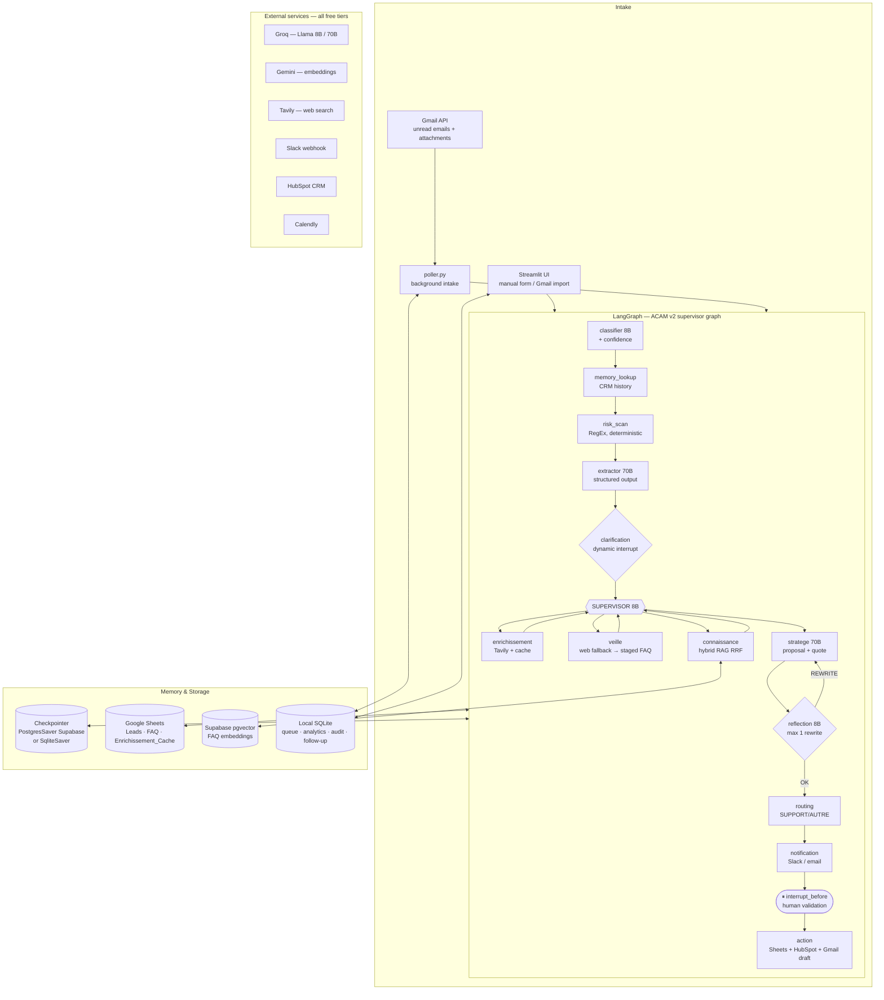
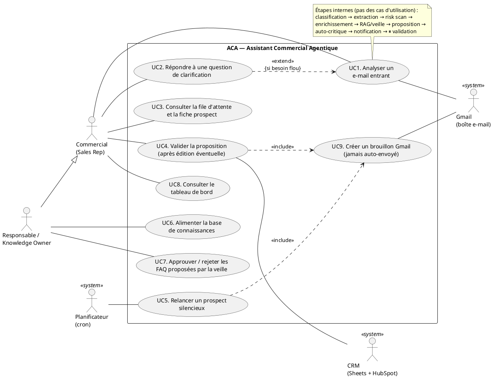

# ACA / ACAM — Assistant Commercial Agentique (Multimodal)
### Presentation source document — structured content for slides
*Internship project, 8 weeks · Prepared 2026-07-16 · Updated 2026-07-28 (§15 security hardening, §16 Solo tier / n8n port / demo mode) · Source of truth: this repository (`CLAUDE.md`, `docs/ACAM_roadmap.md`, `docs/PROJECT_JOURNAL.md`)*

> **How to use this document:** each numbered section maps to a slide group.
> "Key talking points" boxes are the sentences to actually say; tables and diagrams are the visuals.

---

## 01 — Project Context
*Market landscape, objectives, and opportunity*

### Market landscape

- **Inbound-sales overload is universal.** Every B2B company receives a continuous stream of
  incoming emails: demo requests, quote requests (devis), RFPs with PDF/Word/Excel attachments,
  support questions, and spam — all mixed in one inbox. Studies consistently show sales reps spend
  **~20–30 % of their time on non-selling email triage**, and that response time is the #1 predictor
  of lead conversion (a lead answered within an hour is far more likely to convert).
- **The AI-agent wave (2024–2026).** LLM-based "agentic" systems moved from chatbots to
  orchestrated multi-agent workflows (LangGraph, CrewAI, n8n AI nodes). Enterprises now expect AI
  to *prepare* work, not just chat.
- **SME reality (Tunisian & broader emerging-market context).** Small and mid-size companies —
  the typical employer of young graduates entering the job market — cannot afford
  Salesforce Einstein or HubSpot Sales Hub Enterprise licences, dedicated ML teams, or paid LLM
  API budgets. They run on Gmail + spreadsheets. Any solution for this segment must be
  **radically low-cost** and maintainable by non-developers.

### Objectives (from the internship brief)

1. Build an internal tool that **pre-reads incoming emails and their attachments**, extracts the
   key lead information, and prepares the salesperson's work.
2. **Never act autonomously on the CRM**: the system drafts, then **pauses and waits** for a human
   to click "Valider" (human-in-the-loop by design).
3. Answer classic prospect questions (price, deadlines, SLA…) from a **living knowledge base**
   the sales team maintains itself in Google Sheets.
4. Deliver a **functional, secure prototype in 8 weeks** with **zero infrastructure cost**
   (free tiers only).

### The opportunity

- **Time regained:** triage, qualification, enrichment, and first-draft writing are automated;
  the human only reviews and approves.
- **No lead left behind:** every email is classified and logged; support/HR emails are routed to
  the right team instead of dying in a sales inbox.
- **A credible product path:** the prototype is deliberately architected "n8n-ready" and
  multi-tenant-extensible — the same brain can later be sold as a SaaS to other SMEs
  (roadmap §12).

> **Key talking points:** inbound email is where SME sales time goes to die; AI agents can now
> prepare (not replace) human work; the 0-cost constraint is a feature, not a limitation — it makes
> the solution accessible to the companies that need it most.

---

## 02 — Problem Statement
*Key challenges faced by sales teams in SMEs*

> ⚠️ *Note: the original template said "young Tunisians"; adapted to this project's actual target —
> the sales teams of SMEs (Tunisian market context), where many young graduates start their careers.*

**Core problematic (as stated in the roadmap):**
> *How can we automate multimodal ingestion (email + documents), contextual enrichment (RAG), and
> lead qualification — while keeping rigorous human control?*

### The five concrete pain points

| # | Challenge | Consequence |
|---|-----------|-------------|
| P1 | **Manual triage of a mixed inbox** (leads, quotes, support, spam together) | Hours lost daily; high-value leads buried under noise |
| P2 | **Slow, inconsistent responses** | Lead conversion drops sharply with every hour of delay; quality depends on who answers |
| P3 | **Information scattered across attachments** (a real RFP = several PDF/Word/Excel files) | Key requirements, deadlines, and risk clauses get missed |
| P4 | **Tribal knowledge** (prices, SLAs, delays live in people's heads or old emails) | New reps answer wrong or slowly; answers diverge between reps |
| P5 | **Fear of AI acting alone** (hallucinated prices, auto-sent emails, corrupted CRM data) | Companies refuse full automation; adoption is blocked without human control |

### Additional constraints specific to the context

- **Budget = 0 €** — no paid LLM APIs, no hosted vector database, no paid automation platform.
- **Non-technical maintainers** — sales managers must be able to update prices/FAQ without code.
- **Compliance** — GDPR-style retention of personal data; auditability of who validated what.

> **Key talking points:** the problem is not "no AI" — it's that existing AI either costs too much,
> acts too autonomously to be trusted, or can't read the actual documents prospects send.

---

## 03 — Study of Existing Solutions
*Description and critical analysis of current offerings*

| Solution | What it does | Critical analysis (why it doesn't fit) |
|---|---|---|
| **Manual process** (status quo) | Rep reads, triages, searches old emails, writes each reply | Doesn't scale; slow; inconsistent; knowledge stays tribal (P1–P4 all unsolved) |
| **CRM AI suites** — Salesforce Einstein, HubSpot Sales Hub AI, Freshsales Freddy | Email scoring, auto-summaries, reply suggestions inside the CRM | 💰 Per-seat licences far beyond SME budget; locked to their CRM; little/no multimodal attachment analysis; cloud-only, data leaves the company's control |
| **Generic LLM chatbots** — ChatGPT, Gemini used ad hoc | Rep pastes an email, asks for a summary/reply | No integration (no Gmail/CRM/knowledge base); no memory of past customers; **hallucination risk on prices/SLAs**; no audit trail; copy-paste workflow is itself manual |
| **Automation platforms** — Zapier, Make, n8n Cloud + "AI step" | Trigger on email → one LLM call → write a row | Linear pipelines: no supervisor reasoning, no clarification loop, no self-critique, no RAG over company knowledge; n8n **Cloud** and Zapier are paid at useful volumes |
| **Email assistants** — Superhuman AI, Gmail "Help me write" | Drafting aid inside the mailbox | Drafts from generic knowledge, not the company's FAQ/pricing; no qualification, no CRM write, no routing, no risk detection |
| **Custom RAG chatbots** (typical agency offering) | Q&A bot over company docs | Answers questions but doesn't *do* the workflow: no classification, extraction, enrichment, validation gate, or follow-ups; usually needs a paid vector DB |

### Synthesis — the gap

No existing offering combines, at **zero cost**:
1. multimodal ingestion (email **+** PDF/Word/Excel attachments),
2. a **team of specialized agents** with deterministic guardrails,
3. company-specific knowledge (RAG) maintained in a simple spreadsheet,
4. and a **mandatory human validation gate** before any CRM write.

That gap is exactly what ACA fills.

> **Key talking points:** every existing option fails on at least one of: cost, trust
> (autonomous actions / hallucinations), multimodality, or SME maintainability.

---

## 04 — Proposed Solution
*The answer to the problem*

**ACA (Assistant Commercial Agentique)**, evolved into **ACAM v2** — a **supervisor-orchestrated
multi-agent system** built on LangGraph, that pre-reads incoming sales emails and attachments,
qualifies leads, drafts a personalized proposal — and **always stops for human validation** before
touching the CRM.

### The pipeline in one sentence per stage

```
START → classifier (Llama-8B + confidence score) → memory_lookup (returning customer / duplicate)
      → risk_scan (deterministic RegEx: contractual red flags) → extractor (Llama-70B, structured output)
      → clarification (❓ asks the human ONE question if the need is vague — dynamic interrupt)
      → SUPERVISOR (Llama-8B) ⇄ worker agents ──FINISH── routing → notification → ⏸ PAUSE → action → END
                     ├─ enrichissement  (Tavily web research + Sheets cache → company profile)
                     ├─ connaissance    (hybrid RAG: dense Gemini embeddings + sparse keywords, RRF fusion)
                     ├─ veille          (web fallback if FAQ empty → stages new Q&A for human approval)
                     └─ stratege        (Llama-70B → personalized proposal + indicative quote)
                           └→ reflection (Llama-8B self-critique, max 1 rewrite) → routing
```

### How it answers each pain point

| Pain point | ACA answer |
|---|---|
| P1 Triage | Automatic classification into `DEMANDE_DEMO / DEVIS / SUPPORT / AUTRE / SPAM` (measured **100 % accuracy** on a 50-email labeled eval set), with a confidence score — low-confidence cases alert a human |
| P2 Slow response | Background poller analyzes emails as they arrive; the rep opens a **ready-to-validate draft** (Gmail reply draft pre-created in-thread — never auto-sent); automatic follow-up drafts after N days of silence |
| P3 Attachments | All PDF/Word/Excel attachments extracted and analyzed together; deterministic **risk scan** flags dangerous clauses (unlimited liability, penalties, bank guarantee…) |
| P4 Tribal knowledge | "Database-less" **hybrid RAG** over a Google Sheets FAQ the team maintains itself; document ingestion turns any PDF into Q&A rows; web fallback (`veille`) *proposes* new FAQ entries, staged until a human approves them |
| P5 Trust | **Two human interrupts** (mid-graph clarification + final validation), editable draft, self-critique loop, `knowledge_gap` flag (never invent a price), audit log of who validated what, GDPR retention sweep |

### What the human sees (Streamlit UI)

- A queue of analyses waiting for review ("File d'attente"), fed by the background poller.
- Per analysis: category badge, returning-customer/duplicate banners, risk-flag and
  knowledge-gap warnings, a prospect card, the agents' reasoning trace, and an **editable** draft.
- One button — **"Valider"** — which is the *only* path to writing the lead into
  Google Sheets + HubSpot and creating the Gmail reply draft.
- A **dashboard tab**: volumes by category, daily trend, conversion funnel, response times,
  edit rate, tokens per analysis.

> **Key talking points:** "It drafts and waits." The AI does 90 % of the preparation; the human
> keeps 100 % of the decision. Every risky spot (vague need, low confidence, risk clause, missing
> knowledge) is *surfaced*, not silently guessed.

---

## 05 — Functional Requirements
*Defining the system's functional capabilities*

| ID | Requirement | Status |
|----|-------------|--------|
| FR-01 | Classify each incoming email into `DEMANDE_DEMO / DEVIS / SUPPORT / AUTRE / SPAM` with a 0–1 confidence score | ✅ |
| FR-02 | Extract structured lead data `{entreprise, contact, urgence, besoin_principal}` from email body **and** all attachments | ✅ |
| FR-03 | Extract text from multiple attachments per email: PDF, Word (.docx), Excel (.xlsx), with a global size cap | ✅ |
| FR-04 | Detect returning customers and duplicate leads from the CRM history before analysis | ✅ |
| FR-05 | Detect contractual red flags (unlimited liability, late penalties, non-compete, bank guarantee…) deterministically, bilingual FR/EN | ✅ |
| FR-06 | Ask the human **one clarifying question** when the extracted need is vague, then resume with the answer | ✅ |
| FR-07 | Orchestrate specialized worker agents via a supervisor with deterministic guardrails (no repeats, stratège last, spam short-circuits) | ✅ |
| FR-08 | Enrich the lead with a company profile from the sender's domain (web search + cache) | ✅ |
| FR-09 | Answer prospect questions from the company FAQ via hybrid semantic + keyword search with confidence zones | ✅ |
| FR-10 | Fall back to web research when the FAQ has no answer, and **stage** the found Q&A for human approval before it enters the knowledge base | ✅ |
| FR-11 | Flag an explicit `knowledge_gap` when neither FAQ nor web finds an answer — the draft must then answer honestly, never invent | ✅ |
| FR-12 | Generate a personalized proposal draft (reply + indicative quote + next action), appending a real booking link for demo requests | ✅ |
| FR-13 | Self-critique the draft against the knowledge actually used; rewrite at most once | ✅ |
| FR-14 | Route `SUPPORT`/`AUTRE` emails to the right team (alert + prefilled Gmail forward draft) instead of dropping them | ✅ |
| FR-15 | Notify a human (Slack or email) when an analysis waits for validation, including risk flags and knowledge gaps | ✅ |
| FR-16 | **Pause before any CRM action**; only a human "Valider" click resumes execution | ✅ |
| FR-17 | Let the human **edit the draft** before validation; record (original, edited) pairs for future improvement | ✅ |
| FR-18 | On validation: write the lead to Google Sheets **and** HubSpot, mark the Gmail as processed, create a reply draft in-thread (never auto-send) | ✅ |
| FR-19 | Ingest company documents (PDF/Markdown/text) into Q&A knowledge rows via LLM | ✅ |
| FR-20 | Continuously poll the inbox in the background and queue analyses for review (idempotent — no duplicates on crash) | ✅ |
| FR-21 | Draft automatic follow-ups when we were last to speak and N days passed (never auto-sent) | ✅ |
| FR-22 | Provide a dashboard: volume by category, daily trend, funnel, response times, edit rate, token usage | ✅ |
| FR-23 | Keep an audit trail of every validation (who, what, when) behind an optional password gate | ✅ |
| FR-24 | Purge personal data past a retention window (GDPR) | ✅ |
| FR-25 | Alert a human even for normally-silent categories when classification confidence is low | ✅ |

> **Key talking points:** 25 functional requirements, all implemented and verified — most of them
> live-tested against the real Gmail, Sheets, Slack, Tavily, and HubSpot services.

---

## 06 — Technical Requirements
*Architecture, technologies, and infrastructure*

### Architecture



### Technology stack

| Layer | Technology | Why |
|---|---|---|
| Orchestration | **LangGraph** (StateGraph, checkpointer, static + dynamic `interrupt`, `RetryPolicy`) | Cyclic state graph with **native interruption** — the only clean way to do human-in-the-loop before CRM writes; chosen over CrewAI/LangChain Agents for deterministic control |
| LLMs (text) | **Groq** — Llama-3.1-8B (routing/critique) & Llama-3.3-70B (extraction/drafting), free tier | Free, fast; structured output via Pydantic `with_structured_output` (no JSON parsing risk) |
| Embeddings | **Gemini** `gemini-embedding-001`, free tier | Groq has no embeddings endpoint; Gemini fills only that gap |
| RAG storage | **Google Sheets FAQ** + **Supabase pgvector** (optional, `DATABASE_URL`-gated) with in-memory fallback | "Database-less" by default; shared cross-process vector store when configured |
| CRM | **Google Sheets** (`Leads`) + **HubSpot** free CRM (alongside, not replacing) | Editable by any salesperson; real CRM path proven |
| State persistence | **PostgresSaver** (Supabase) or **SqliteSaver** | Validation pauses survive restarts and are shared between the UI and the poller processes |
| Email | **Gmail API** (OAuth, `gmail.modify`) | Read unread, label processed, create reply/forward **drafts** — never send |
| Web research | **Tavily** free tier | Company enrichment + FAQ web fallback, always cached |
| UI | **Streamlit** (Fluent theme) | Validation gate, queue, clarification dialog, editable draft, dashboard — built in days, not weeks |
| Documents | PyMuPDF · python-docx · openpyxl | Multi-format attachment extraction |
| Observability | **LangSmith** (free tier) + local analytics SQLite + token logging | Per-node traces; KPIs without paid infra |
| Packaging | **Docker** (one image, four services) + **compose profiles** `solo` / `enterprise` | Same image both tiers; n8n added or removed by one word. Credentials mounted read-only, never baked into a layer; non-root user |
| CI | **GitHub Actions** — tests on Python 3.11 + 3.14, `pip-audit`, derived-artifact drift check | Possible only because the suite is fully offline: it runs on a public runner with no secrets |
| Testing | **pytest** — 352 offline tests (~13 s) + 50-email labeled eval set | Fake LLMs, temp DBs, full-graph integration tests; classifier measured at 100 % |

### Non-functional requirements (all implemented)

- **Resilience:** `RetryPolicy` (3 attempts, incl. HTTP 429) on every external-API node; retry
  decorator on all out-of-graph SQLite writes; graceful degradation everywhere (every optional
  service off = feature silently skipped, never a crash).
- **Idempotence:** poller marks emails `en_cours` *before* analysis; crash mid-analysis cannot
  duplicate processing; stale entries auto-recovered.
- **Autonomy:** `poller.py` ingests Gmail and runs the graph 24/7 with the UI closed; `scheduler.py`
  runs follow-ups, the GDPR purge and queue maintenance on a cadence. **No n8n required** —
  one command starts all four processes (`python scripts/run_solo.py`).
- **Security & compliance:** named accounts with roles, expiring sessions, hash-chained audit log,
  GDPR purge *and* right to erasure, prompt-injection flagging, and a production mode that refuses
  to start unprotected. Full detail in Appendix C.
- **Cost: 0 €** — every service used is a free tier; the n8n tier targets self-hosted community
  edition (free), never n8n Cloud (paid).
- **Portability:** each capability is an isolated node/module, driven over HTTP by `aca/api.py`
  with 5 outbound webhooks — so n8n orchestrates ACA rather than replacing any of it.

> **Key talking points:** the architecture is defensive by design — retries, fallbacks, staging,
> and two human interrupts; and it costs literally nothing to run.

---

## 07 — Added Value & Innovation

### The three founding innovation pillars

1. **Multimodal analysis** — email body + *all* PDF/Word/Excel attachments analyzed jointly into a
   structured qualification.
2. **"Database-less" semantic RAG** — the knowledge base *is* a Google Sheet; hybrid retrieval
   (dense Gemini embeddings + sparse keyword matching, fused by Reciprocal Rank Fusion) with an
   empirically calibrated dual confidence threshold ("amber zone") — no vector DB required, though
   pgvector is plugged in transparently when available.
3. **Hybrid memory + human-in-the-loop** — the graph freezes mid-execution (checkpointer), keeps
   its memory across restarts and processes, and resumes exactly where it paused after validation.

### What goes beyond the initial brief (differentiators)

| Innovation | Value |
|---|---|
| **Supervisor + agent team** instead of a linear pipeline | Dynamic orchestration with deterministic guardrails; each agent has one job and its own memory |
| **Self-critique loop** (`reflection`, capped at 1 rewrite) | Catches unsupported claims (invented price/deadline) *before* the human sees the draft |
| **Self-enriching knowledge base with human staging** | The system *learns* from unanswered questions — but new knowledge is invisible until a human approves it |
| **Deterministic contractual risk scan** | Zero-LLM, zero-cost RegEx detection of dangerous clauses in RFPs — surfaced in the alert and the UI |
| **Explicit `knowledge_gap` honesty flag** | The agent is *told* when it knows nothing — so it never invents specifics |
| **Query de-contextualization** | RAG queries are built from the extracted need (and resolved against customer history for implicit references), not the raw email — measurably better retrieval |
| **Classification confidence routing** | Low-confidence classifications alert a human even for normally-silent categories (spam/support) — the riskiest silent failure is eliminated |
| **Edit-capture corpus** | Every human edit of a draft is recorded as an (original, edited) pair — a free future few-shot/eval dataset |
| **Two deployment tiers, n8n optional** | Solo (API + UI + poller + scheduler) is autonomous *without* n8n; Enterprise adds it for cross-system orchestration. Same image, same code — one word on the compose line. The distinction "automation ≠ orchestration" is itself the product argument |
| **Event-driven integration, not polling** | 5 outbound HMAC-signed webhooks push state to n8n; the alternative would have been reimplementing our own poller inside n8n |
| **Zero-credential demo mode** | The whole graph runs with no API key at all — real nodes, real supervisor, real pause, simulated model. Evaluators can *run* it, not just read it. CRM writes fail loudly rather than degrading quietly |
| **Full measurement culture** | 352 automated tests, a 50-email labeled eval set (100 % accuracy), token-per-analysis logging, edit rate, response-time funnel, `pip-audit` in CI |
| **Critical audit of AI-generated advice** | Three external AI-written architecture documents were audited against the real code; good ideas were adopted, and **two factual errors were caught before being copied in** (a wrong hallucination-gate threshold and a mis-sized vector schema) |

### Measured results

- Classifier accuracy: **100 %** (50/50) on the labeled eval set (96 % before structured-output migration).
- Test suite: **352 tests, ~13 s, fully offline** — no key, no network, so it also runs on a public
  CI runner with zero secrets.
- Live-verified integrations: Gmail, Google Sheets, Slack, Tavily, HubSpot, Supabase (pgvector +
  cross-process checkpointing + RLS), LangSmith, Calendly link injection, GDPR purge/erasure.
- Dependency scan (`pip-audit`): **0 known vulnerabilities**.
- Verification caught **real bugs before production**: a retry-swallowing anti-pattern, a
  cp1252 print crash that would have *duplicated CRM leads*, a silent pgvector
  misconfiguration, an IPv6-only database host, four raw-exception leaks in the UI, a dashboard
  session cookie that never expired server-side, a graph diagram silently out of sync with the
  real graph, and an outbound event that was documented but never emitted.

> **Key talking points:** the innovation is not "we used an LLM" — it's the *governance around*
> the LLM: guardrails, staging, self-critique, honesty flags, and measurement, at zero cost.

---

## 08 — Conclusion & SDGs

### Conclusion

- In 8 weeks, a **complete, tested, live-verified** multi-agent assistant was delivered: from raw
  Gmail inbox to validated CRM lead with a ready-to-send draft — with a human always in command.
- The 0-€ constraint was held end-to-end, proving that **state-of-the-art agentic AI is accessible
  to SMEs**, not just enterprises.
- The prototype is deliberately **product-ready in shape**: two packaged deployment tiers, a
  hardened security posture (named accounts, expiring sessions, chained audit log, GDPR erasure),
  CI, and a technical-debt list already mostly paid down (tests, retries, structured outputs).
- It can now be **evaluated without any account at all** — `ACA_DEMO_MODE` runs the real graph with
  a simulated model, which turns "interesting repository" into "I just ran it".
- Honest limits: single-tenant today; the follow-up cadence isn't yet verified against a real Gmail
  thread with a prospect reply; usage billing (Stripe) scaffolded but not live-verified (no test
  account); the n8n workflow and the Docker image are written but never run against a real instance
  (no n8n, no Docker on the dev machine); nothing is hosted, so TLS is documented rather than
  applied; free-tier rate limits won't survive commercial traffic (a paid-model switch is budgeted
  in the SaaS phase).
- **None of those limits is missing code** — each is a missing account, instance or host. Saying so
  precisely is, itself, part of the engineering.

### Sustainable Development Goals alignment

| SDG | How the project contributes |
|---|---|
| **SDG 8 — Decent Work & Economic Growth** | Removes repetitive triage drudgery from sales work and shortens response times that win contracts — productivity growth for SMEs, more meaningful work for employees; a young-graduate internship producing durable skills (AI orchestration, MLOps practices) |
| **SDG 9 — Industry, Innovation & Infrastructure** | Brings agentic-AI infrastructure to resource-constrained businesses using only free tiers and open-source tooling; documented, reproducible architecture others can adopt (Tunisian SME digitalization) |
| **SDG 12 — Responsible Consumption & Production** | Frugal-AI approach: small models where they suffice (8B for routing/critique, 70B only where needed), deterministic code instead of LLM calls where possible (risk scan, guardrails, link injection), caching to avoid repeated web/API calls, token usage measured per analysis |
| **SDG 16 (secondary) — Peace, Justice & Strong Institutions** | Accountability by construction: audit trail, human validation gates, GDPR retention, no autonomous outbound action — a template for *responsible* AI deployment |

> **Key talking points:** the project demonstrates that responsible, human-controlled, frugal AI is
> not a compromise — it's a better product.

---

## Appendix A — UML Use Case Diagram

**Modeling rules applied (why this version is small and correct):**
- A use case = a complete goal delivering value to an actor. The internal pipeline steps
  (classification, extraction, risk scan, enrichment, RAG, drafting, notification, routing) are
  **steps inside one use case** — *UC1 Analyser un e-mail entrant* — not separate use cases.
- An actor = an external entity that directly interacts with the system. Groq/Gemini/Tavily are
  internal implementation (not actors), Slack is a mere notification channel, and the Prospect
  never touches the system (Gmail is the real interface).
- **Layout:** primary (human) actors on the **left**; secondary (system) actors — Gmail, CRM,
  scheduler — on the **right**.
- **Notation:** actor–use-case **associations are plain solid lines** (no arrowheads);
  **«include»** is a dashed arrow from the base use case **to** the included one (UC4/UC5 both
  include *UC9 Créer un brouillon Gmail*); **«extend»** is a dashed arrow from the extension
  **to** the base (UC2 extends UC1, condition: *besoin flou*); **generalization** is a solid line
  with a hollow triangle — the *Responsable* inherits all the *Commercial*'s use cases, so those
  associations are not repeated.

### PlantUML (render at plantuml.com or any PlantUML plugin — best for the report)



### Mermaid approximation (renders directly on GitHub / in artifacts)


---

## Appendix B — Product Backlog & Sprints

**Method:** Scrum — **4 sprints × 2 weeks = the 8-week internship**. Priorities in MoSCoW,
estimates in story points. This appendix shows the **headline features only**; the exhaustive
item-by-item backlog lives in `docs/ACAM_roadmap.md`.

**Product vision (the one sentence the whole backlog serves):**
> *Your sales email is read, qualified, researched and answered while you're away — and nothing
> reaches your CRM until you click "Validate".*

### Epics — what each one is worth to the customer

| Epic | Name | Customer value |
|---|---|---|
| E1 | **Read & qualify** | Stop triaging the inbox by hand — every email arrives already sorted and summarised |
| E2 | **Human stays in command** | The AI drafts, the human decides. No autonomous action on the CRM, ever |
| E3 | **Knows your business** | Answers come from *your* prices and rules, editable by your team in a spreadsheet |
| E4 | **Fits your existing tools** | Gmail, Google Sheets, HubSpot, Slack — no new habits to learn |
| E5 | **Thinks before it writes** | A team of specialist agents researches, drafts, then re-reads its own work |
| E6 | **Runs on its own** | Works nights and weekends; nothing to remember to launch |
| E7 | **Proves its value** | Volumes, conversion funnel, response times, cost per analysis |
| E8 | **Ready to sell** | Two deployment tiers, per-client isolation, usage metering |
| E9 | **Safe to trust** | Named accounts, tamper-evident audit trail, GDPR rights |

### Sprint 1 (Weeks 1–2) — "Walking skeleton" ✅

| ID | User story | Epic | MoSCoW | Pts | Status |
|----|-----------|------|--------|-----|--------|
| US-01 | As a **sales rep**, I want incoming emails automatically classified (demo/quote/support/other/spam) so that I stop triaging my inbox manually | E1 | Must | 5 | ✅ |
| US-02 | As a **sales rep**, I want key lead info (company, contact, urgency, need) extracted automatically so that I don't re-read every email | E1 | Must | 5 | ✅ |
| US-03 | As a **sales rep**, I want an analysis to stop and resume exactly where it left off so that waiting for my decision never costs work or restarts | E1 | Must | 5 | ✅ |
| US-04 | As a **sales rep**, I want qualified leads landing in the spreadsheet my team already uses so that nobody changes their habits | E4 | Must | 3 | ✅ |

**Sprint goal:** an email goes in, a qualified lead comes out.

### Sprint 2 (Weeks 3–4) — "Multimodal + human control" ✅

| ID | User story | Epic | MoSCoW | Pts | Status |
|----|-----------|------|--------|-----|--------|
| US-05 | As a **sales rep**, I want PDF attachments analyzed together with the email so that RFP details aren't missed | E1 | Must | 5 | ✅ |
| US-06 | As a **manager**, I want the system to **pause before any CRM write** until a human clicks "Valider" so that the AI never acts alone | E2 | Must | 8 | ✅ |
| US-07 | As a **sales rep**, I want one screen showing the prospect, the draft and a Validate button so that reviewing takes seconds | E2 | Must | 5 | ✅ |
| US-08 | As a **sales rep**, I want to be told when a sender is already a customer or a duplicate so that I never create a double entry | E1 | Should | 3 | ✅ |

**Sprint goal:** nothing reaches the CRM without a human clicking Validate.

### Sprint 3 (Weeks 5–6) — "Knowledge & real inbox" ✅

| ID | User story | Epic | MoSCoW | Pts | Status |
|----|-----------|------|--------|-----|--------|
| US-09 | As a **prospect**, I want my usual questions (price, deadlines, SLA) answered from the company's real FAQ so that replies are accurate, not generic | E3 | Must | 8 | ✅ |
| US-10 | As a **manager**, I want the knowledge base to live in a spreadsheet so that my team updates prices without calling a developer | E3 | Must | 3 | ✅ |
| US-11 | As a **manager**, I want to drop in a PDF and have it become answerable knowledge so that onboarding takes minutes | E3 | Should | 5 | ✅ |
| US-12 | As a **sales rep**, I want it working on my **real** mailbox, not a demo one | E4 | Must | 8 | ✅ |

**Sprint goal:** the assistant answers from company knowledge and reads the real mailbox.

### Sprint 4 (Weeks 7–8) — "Multi-agent team + production hardening" ✅

| ID | User story | Epic | MoSCoW | Pts | Status |
|----|-----------|------|--------|-----|--------|
| US-14 | As a **manager**, I want a supervisor directing specialist agents (research, knowledge, web-watch, writing) so that each email gets exactly the work it needs — no more, no less | E5 | Must | 13 | ✅ |
| US-15 | As a **sales rep**, I want the assistant to **ask me one question** when a request is vague, instead of guessing | E2 | Must | 5 | ✅ |
| US-16 | As a **sales rep**, I want the prospect's company researched automatically so that I open every conversation informed | E5 | Should | 5 | ✅ |
| US-18 | As a **sales rep**, I want the draft to **re-read itself** against our FAQ so that invented prices never reach me | E5 | Should | 5 | ✅ |
| US-20 | As a **sales rep**, I want emails analysed in the background so that the work is already done when I arrive | E6 | Must | 8 | ✅ |
| US-23 | As a **sales rep**, I want a reply waiting as a draft in my own mailbox so that I only reread and press Send | E4 | Must | 5 | ✅ |
| US-24 | As a **sales rep**, I want follow-ups prepared automatically after days of silence so that leads don't go cold | E6 | Should | 5 | ✅ |
| US-29 | As a **manager**, I want dangerous contract clauses flagged so that risky commitments reach legal, not the prospect | E1 | Should | 3 | ✅ |
| US-27 | As a **manager**, I want a dashboard of volumes, conversion and response times so that I can prove the tool's impact | E7 | Should | 5 | ✅ |

*Also delivered this sprint (supporting, not headline): restart-proof pauses, Slack/email alerts,
support & HR routing, editable drafts with edit capture, GDPR purge, audit log, cost-per-analysis
logging, low-confidence alerting, and the automated test suite + labeled evaluation set — US-17,
19, 21, 22, 25, 26, 28, 30, 31, 32.*

**Sprint goal:** a production-shaped system: resilient, measured, auditable, and working while
nobody is watching.

### Beyond the 8 weeks — from prototype to product

*The 8-week backlog above was the internship. Everything below was scoped as **post-internship**
work and then pulled forward at the client's request. Shown as themes rather than tickets — the
full 20-story detail is in `docs/ACAM_roadmap.md` §12–§16.*

| Theme | What the customer gets | Status |
|---|---|---|
| **Sell it to several companies** | Each client's data isolated from every other's, enforced at the database level | ✅ Foundation live-verified · onboarding still manual |
| **Configure without a developer** | A settings screen for booking links, routing addresses and follow-up timing | ✅ Done |
| **Know what it costs** | Usage metered per client, ready to bill | 🟡 Built, never billed (no payment account) |
| **Approve from Slack** | Validate or reject a lead without opening any interface | ✅ Done |
| **Plug into the rest of the business** | Connect ACA to a CRM, ERP or ticketing system via n8n | ✅ Ready · never run against a live n8n |
| **Run it anywhere** | Two packaged tiers — *Solo* (works alone) and *Enterprise* (adds n8n) | ✅ Packaged · image never built |
| **Trust it with a real inbox** | Named accounts and roles, expiring sessions, a tamper-evident audit trail, GDPR erasure on request | ✅ Done |
| **Try it in 30 seconds** | The whole product runs with no account and no API key at all | ✅ Done |

> **The finding worth telling in the defence.** The last phase began as a narrow technical
> question. Auditing the code instead of answering from memory surfaced something bigger:
> **the product was already autonomous but didn't look it, and the orchestration tool couldn't
> actually have driven it.** Two problems long conflated into one ("you need n8n for this to be
> automatic"), both false for opposite reasons. That reframing produced the Solo/Enterprise
> tiering — now the clearest part of the commercial pitch.

### Velocity summary

| Sprint | Weeks | Committed | Delivered | Theme |
|---|---|---|---|---|
| S1 | 1–2 | 18 | 18 ✅ | Walking skeleton — an email in, a qualified lead out |
| S2 | 3–4 | 21 | 21 ✅ | Attachments + the human validation gate |
| S3 | 5–6 | 27 | 27 ✅ | Company knowledge + the real mailbox |
| S4 | 7–8 | 94 | 94 ✅ | Agent team, autonomy, measurement (largest sprint) |
| **Total (internship)** | **8 weeks** | **160** | **160 ✅** | **Scope delivered in full** |
| Extension | post-8w | 122 | ~114 ✅ | Commercialisation, security, packaging — pulled forward on request. Only usage billing left unverified |

---

## Appendix C — Security posture & hardening

*Prepared for the "how secure is it?" question. The honest one-line answer: **security by
architecture** — the worst case is a bad draft a human rejects, never an autonomous harmful action —
plus concrete hardening of the surfaces that untrusted input actually reaches.*

### Controls in place (verified)

| Surface | Control | Note |
|---|---|---|
| CRM write | **Human validation gate** (`interrupt_before=["action"]`) | Nothing reaches Sheets/HubSpot/Gmail-send without a human click — the core promise, and the root security guarantee |
| Slack approval endpoint | **HMAC-SHA256 signature**, constant-time compare, anti-replay, **fails closed** if `SLACK_SIGNING_SECRET` unset | The only place a click writes to CRM without the API key — and the best-guarded one ([slack_verify.py](../aca/core/slack_verify.py)) |
| FastAPI (all routes) | Optional **`ACA_API_KEY`** gate + **rate limiting** (`ACA_RATE_LIMIT`, per-client sliding window, HTTP 429) | Blocks both unauthenticated access *and* abuse/brute-force by a client |
| Streamlit / dashboard login | **Named accounts + `admin`/`operator` roles** (US-44), PBKDF2 hashes, progressive lockout (US-41), constant-time comparison | Replaces the shared password. A dummy hash on unknown usernames stops response time revealing which accounts exist |
| Sessions | **Absolute TTL (8 h) + idle timeout (30 min)**, strictest wins (US-45) | Activity pushes back idleness but *never* the absolute TTL — otherwise a stolen-but-active session never dies |
| Audit log | **Hash-chained** rows (US-46); `verify_chain()` locates the first break; optional HMAC key | Detects an edited *or deleted* row. Tamper-**evident**, not tamper-proof — said plainly, since without the external key whoever can write the file can recompute it |
| Untrusted email → LLM | **Deterministic prompt-injection detection** (`prompt_guard.py`), kept separate from contractual risk flags | Flags, never blocks — see below |
| Startup | `ACA_ENV=production` **refuses to boot** without API key, UI gate, rate limit and metrics token (US-48) | Inverts the project's "absent = feature skipped" default, which is right locally and exactly wrong on a public host |
| Spreadsheet writes | **Formula-injection escaping** on every untrusted field (sender, need, draft, web-sourced FAQ) | A lead arriving as `=IMPORTXML(...)` can no longer execute when a human opens the sheet ([sheets.py](../aca/integrations/sheets.py) `_escape_formula`) |
| Multi-tenant DB | **Row-Level Security** on `faq_embeddings` via a non-`BYPASSRLS` `aca_app` role | Live-verified: a bogus tenant sees 0 of 74 rows |
| Data at rest | Secrets in gitignored `.env`/`credentials/`, read server-side via `os.getenv`, never in a client bundle | The §14 audit correctly dismissed "exposed keys" as a non-issue (no JS frontend to leak from) |
| Personal data | GDPR retention sweep + **right to erasure** (`--oublier <address>`, US-47) + published privacy policy (US-42) + per-validation audit log | Age-based purge was the easy half; an explicit request previously meant hand-hunting rows across a Sheet, a checkpoint file and two registries — so in practice it never happened |
| Dependencies | `pip-audit` in CI (US-52) | The first scan found 17 known vulnerabilities, **11 of them in transitive packages the project never imports** — "requirements.txt is pinned" was false assurance |

### Prompt injection (untrusted email → LLM)

Every incoming email is attacker-controlled text fed to the classifier/extractor/stratège. The
defense is **architectural, not a filter**: (1) the human-in-the-loop gate means a manipulated draft
still hits a human before any CRM write or send; (2) the contractual **risk scan is deterministic
RegEx**, not an LLM, so it can't be "talked out of" flagging a clause.

§15 added a third layer: [prompt_guard.py](../aca/core/prompt_guard.py) detects injection attempts
deterministically (no LLM — asking a model to spot model-manipulation exposes it to that
manipulation) into a **separate** `injection_flags` list. Kept separate from risk flags on purpose:
a contractual clause means *"have legal review this"*, an injection means *"distrust this draft"* —
merging them would hand "ignore previous instructions" to the Stratège as a clause to escalate to
management. It **flags, never blocks**: the human gate stays the protection, this only makes it
*informed*. Before it, an instruction buried on page 14 of an RFP surfaced in the draft as one more
plausible sentence. Zero false positives across a set of ten perfectly ordinary sales emails.

### Deliberately deferred (phase-gaps, not quick fixes — named honestly)

*Per-user identity was on this list until §15 — it is now built (US-44/45), so it has moved up to
the controls table. What remains is genuinely deferred, and none of it is missing code:*

| Item | Why deferred | Interim state |
|---|---|---|
| **TLS / HTTPS** | Nothing is hosted — applying it needs a real server and domain | Full Caddy/Nginx runbook written ([DEPLOYMENT_HARDENING.md](DEPLOYMENT_HARDENING.md)), applied on deploy day |
| **Secrets vault** (Vault/Doppler) | A hosting decision, not a code one | Rules + per-secret rotation table documented; **no code change will be needed** — every module already reads `os.getenv()` dynamically |
| **SSO / 2FA** | Local accounts cover the real model (one deployment, a small team) | Named accounts with roles (US-44) |
| **DB-enforced isolation on the local SQLite stores** | Real model is one-deployment-per-tenant; app-level `org_id` scoping is sufficient there (unlike the shared pgvector table, which *is* RLS-enforced) | Application-level `org_id` filter on every query |
| **Multi-process rate-limit backend** (Redis) | In-memory sliding window is exact at single-process prototype scale | Correct for one uvicorn worker; needs a shared store before horizontal scaling |
| **DPA / DPIA documents** | Legal artefacts belonging to the using company, not derivable from code | Privacy policy published (US-42) |

> **Key talking points:** the security story is not "it's locked down like a bank" — it's *"every
> surface untrusted input touches is either escaped, signed, rate-limited, or gated behind a human,
> and the three things that aren't done are deferred on purpose, with the interim state stated
> plainly."* That honesty is itself the security-maturity signal.

---

*End of presentation source document. To export as PDF: open this file in VS Code with a
Markdown-PDF extension, or `pandoc docs/ACA_presentation_source.md -o ACA_presentation.pdf`
(mermaid/plantuml blocks render best via the PlantUML server or the VS Code Mermaid preview).*
