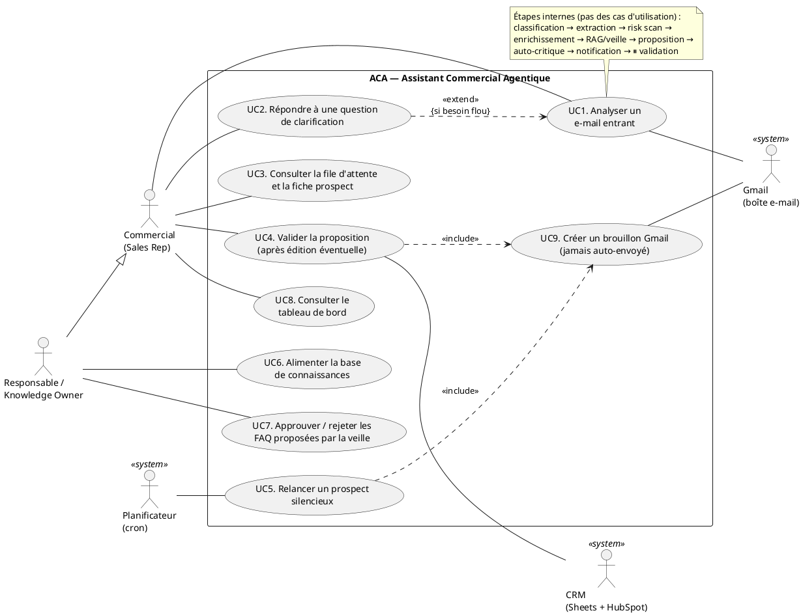
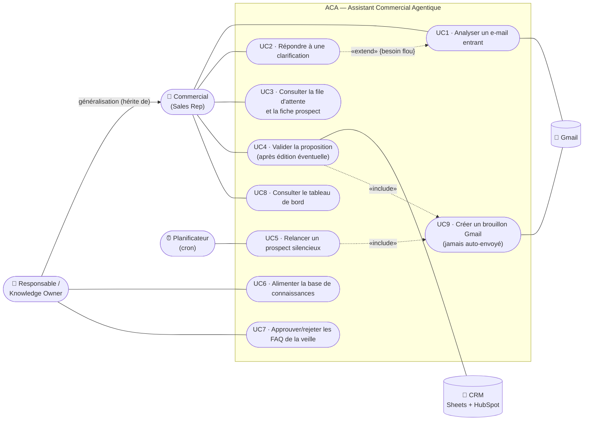

# ACA / ACAM — Assistant Commercial Agentique (Multimodal)
### Presentation source document — structured content for slides
*Internship project, 8 weeks · Prepared 2026-07-16 · Source of truth: this repository (`CLAUDE.md`, `docs/ACAM_roadmap.md`, `docs/PROJECT_JOURNAL.md`)*

> **How to use this document:** each numbered section maps to a slide group.
> "Key talking points" boxes are the sentences to actually say; tables and diagrams are the visuals.

---

## 01 — Project Context
*Market landscape, objectives, and opportunity*

### Market landscape

- **Inbound-sales overload is universal.** Every B2B company receives a continuous stream of
  incoming emails: demo requests, quote requests (devis), RFPs with PDF/Word/Excel attachments,
  support questions, and spam — all mixed in one inbox. Studies consistently show sales reps spend
  **~20–30 % of their time on non-selling email triage**, and that response time is the #1 predictor
  of lead conversion (a lead answered within an hour is far more likely to convert).
- **The AI-agent wave (2024–2026).** LLM-based "agentic" systems moved from chatbots to
  orchestrated multi-agent workflows (LangGraph, CrewAI, n8n AI nodes). Enterprises now expect AI
  to *prepare* work, not just chat.
- **SME reality (Tunisian & broader emerging-market context).** Small and mid-size companies —
  the typical employer of young graduates entering the job market — cannot afford
  Salesforce Einstein or HubSpot Sales Hub Enterprise licences, dedicated ML teams, or paid LLM
  API budgets. They run on Gmail + spreadsheets. Any solution for this segment must be
  **radically low-cost** and maintainable by non-developers.

### Objectives (from the internship brief)

1. Build an internal tool that **pre-reads incoming emails and their attachments**, extracts the
   key lead information, and prepares the salesperson's work.
2. **Never act autonomously on the CRM**: the system drafts, then **pauses and waits** for a human
   to click "Valider" (human-in-the-loop by design).
3. Answer classic prospect questions (price, deadlines, SLA…) from a **living knowledge base**
   the sales team maintains itself in Google Sheets.
4. Deliver a **functional, secure prototype in 8 weeks** with **zero infrastructure cost**
   (free tiers only).

### The opportunity

- **Time regained:** triage, qualification, enrichment, and first-draft writing are automated;
  the human only reviews and approves.
- **No lead left behind:** every email is classified and logged; support/HR emails are routed to
  the right team instead of dying in a sales inbox.
- **A credible product path:** the prototype is deliberately architected "n8n-ready" and
  multi-tenant-extensible — the same brain can later be sold as a SaaS to other SMEs
  (roadmap §12).

> **Key talking points:** inbound email is where SME sales time goes to die; AI agents can now
> prepare (not replace) human work; the 0-cost constraint is a feature, not a limitation — it makes
> the solution accessible to the companies that need it most.

---

## 02 — Problem Statement
*Key challenges faced by sales teams in SMEs*

> ⚠️ *Note: the original template said "young Tunisians"; adapted to this project's actual target —
> the sales teams of SMEs (Tunisian market context), where many young graduates start their careers.*

**Core problematic (as stated in the roadmap):**
> *How can we automate multimodal ingestion (email + documents), contextual enrichment (RAG), and
> lead qualification — while keeping rigorous human control?*

### The five concrete pain points

| # | Challenge | Consequence |
|---|-----------|-------------|
| P1 | **Manual triage of a mixed inbox** (leads, quotes, support, spam together) | Hours lost daily; high-value leads buried under noise |
| P2 | **Slow, inconsistent responses** | Lead conversion drops sharply with every hour of delay; quality depends on who answers |
| P3 | **Information scattered across attachments** (a real RFP = several PDF/Word/Excel files) | Key requirements, deadlines, and risk clauses get missed |
| P4 | **Tribal knowledge** (prices, SLAs, delays live in people's heads or old emails) | New reps answer wrong or slowly; answers diverge between reps |
| P5 | **Fear of AI acting alone** (hallucinated prices, auto-sent emails, corrupted CRM data) | Companies refuse full automation; adoption is blocked without human control |

### Additional constraints specific to the context

- **Budget = 0 €** — no paid LLM APIs, no hosted vector database, no paid automation platform.
- **Non-technical maintainers** — sales managers must be able to update prices/FAQ without code.
- **Compliance** — GDPR-style retention of personal data; auditability of who validated what.

> **Key talking points:** the problem is not "no AI" — it's that existing AI either costs too much,
> acts too autonomously to be trusted, or can't read the actual documents prospects send.

---

## 03 — Study of Existing Solutions
*Description and critical analysis of current offerings*

| Solution | What it does | Critical analysis (why it doesn't fit) |
|---|---|---|
| **Manual process** (status quo) | Rep reads, triages, searches old emails, writes each reply | Doesn't scale; slow; inconsistent; knowledge stays tribal (P1–P4 all unsolved) |
| **CRM AI suites** — Salesforce Einstein, HubSpot Sales Hub AI, Freshsales Freddy | Email scoring, auto-summaries, reply suggestions inside the CRM | 💰 Per-seat licences far beyond SME budget; locked to their CRM; little/no multimodal attachment analysis; cloud-only, data leaves the company's control |
| **Generic LLM chatbots** — ChatGPT, Gemini used ad hoc | Rep pastes an email, asks for a summary/reply | No integration (no Gmail/CRM/knowledge base); no memory of past customers; **hallucination risk on prices/SLAs**; no audit trail; copy-paste workflow is itself manual |
| **Automation platforms** — Zapier, Make, n8n Cloud + "AI step" | Trigger on email → one LLM call → write a row | Linear pipelines: no supervisor reasoning, no clarification loop, no self-critique, no RAG over company knowledge; n8n **Cloud** and Zapier are paid at useful volumes |
| **Email assistants** — Superhuman AI, Gmail "Help me write" | Drafting aid inside the mailbox | Drafts from generic knowledge, not the company's FAQ/pricing; no qualification, no CRM write, no routing, no risk detection |
| **Custom RAG chatbots** (typical agency offering) | Q&A bot over company docs | Answers questions but doesn't *do* the workflow: no classification, extraction, enrichment, validation gate, or follow-ups; usually needs a paid vector DB |

### Synthesis — the gap

No existing offering combines, at **zero cost**:
1. multimodal ingestion (email **+** PDF/Word/Excel attachments),
2. a **team of specialized agents** with deterministic guardrails,
3. company-specific knowledge (RAG) maintained in a simple spreadsheet,
4. and a **mandatory human validation gate** before any CRM write.

That gap is exactly what ACA fills.

> **Key talking points:** every existing option fails on at least one of: cost, trust
> (autonomous actions / hallucinations), multimodality, or SME maintainability.

---

## 04 — Proposed Solution
*The answer to the problem*

**ACA (Assistant Commercial Agentique)**, evolved into **ACAM v2** — a **supervisor-orchestrated
multi-agent system** built on LangGraph, that pre-reads incoming sales emails and attachments,
qualifies leads, drafts a personalized proposal — and **always stops for human validation** before
touching the CRM.

### The pipeline in one sentence per stage

```
START → classifier (Llama-8B + confidence score) → memory_lookup (returning customer / duplicate)
      → risk_scan (deterministic RegEx: contractual red flags) → extractor (Llama-70B, structured output)
      → clarification (❓ asks the human ONE question if the need is vague — dynamic interrupt)
      → SUPERVISOR (Llama-8B) ⇄ worker agents ──FINISH── routing → notification → ⏸ PAUSE → action → END
                     ├─ enrichissement  (Tavily web research + Sheets cache → company profile)
                     ├─ connaissance    (hybrid RAG: dense Gemini embeddings + sparse keywords, RRF fusion)
                     ├─ veille          (web fallback if FAQ empty → stages new Q&A for human approval)
                     └─ stratege        (Llama-70B → personalized proposal + indicative quote)
                           └→ reflection (Llama-8B self-critique, max 1 rewrite) → routing
```

### How it answers each pain point

| Pain point | ACA answer |
|---|---|
| P1 Triage | Automatic classification into `DEMANDE_DEMO / DEVIS / SUPPORT / AUTRE / SPAM` (measured **100 % accuracy** on a 50-email labeled eval set), with a confidence score — low-confidence cases alert a human |
| P2 Slow response | Background poller analyzes emails as they arrive; the rep opens a **ready-to-validate draft** (Gmail reply draft pre-created in-thread — never auto-sent); automatic follow-up drafts after N days of silence |
| P3 Attachments | All PDF/Word/Excel attachments extracted and analyzed together; deterministic **risk scan** flags dangerous clauses (unlimited liability, penalties, bank guarantee…) |
| P4 Tribal knowledge | "Database-less" **hybrid RAG** over a Google Sheets FAQ the team maintains itself; document ingestion turns any PDF into Q&A rows; web fallback (`veille`) *proposes* new FAQ entries, staged until a human approves them |
| P5 Trust | **Two human interrupts** (mid-graph clarification + final validation), editable draft, self-critique loop, `knowledge_gap` flag (never invent a price), audit log of who validated what, GDPR retention sweep |

### What the human sees (Streamlit UI)

- A queue of analyses waiting for review ("File d'attente"), fed by the background poller.
- Per analysis: category badge, returning-customer/duplicate banners, risk-flag and
  knowledge-gap warnings, a prospect card, the agents' reasoning trace, and an **editable** draft.
- One button — **"Valider"** — which is the *only* path to writing the lead into
  Google Sheets + HubSpot and creating the Gmail reply draft.
- A **dashboard tab**: volumes by category, daily trend, conversion funnel, response times,
  edit rate, tokens per analysis.

> **Key talking points:** "It drafts and waits." The AI does 90 % of the preparation; the human
> keeps 100 % of the decision. Every risky spot (vague need, low confidence, risk clause, missing
> knowledge) is *surfaced*, not silently guessed.

---

## 05 — Functional Requirements
*Defining the system's functional capabilities*

| ID | Requirement | Status |
|----|-------------|--------|
| FR-01 | Classify each incoming email into `DEMANDE_DEMO / DEVIS / SUPPORT / AUTRE / SPAM` with a 0–1 confidence score | ✅ |
| FR-02 | Extract structured lead data `{entreprise, contact, urgence, besoin_principal}` from email body **and** all attachments | ✅ |
| FR-03 | Extract text from multiple attachments per email: PDF, Word (.docx), Excel (.xlsx), with a global size cap | ✅ |
| FR-04 | Detect returning customers and duplicate leads from the CRM history before analysis | ✅ |
| FR-05 | Detect contractual red flags (unlimited liability, late penalties, non-compete, bank guarantee…) deterministically, bilingual FR/EN | ✅ |
| FR-06 | Ask the human **one clarifying question** when the extracted need is vague, then resume with the answer | ✅ |
| FR-07 | Orchestrate specialized worker agents via a supervisor with deterministic guardrails (no repeats, stratège last, spam short-circuits) | ✅ |
| FR-08 | Enrich the lead with a company profile from the sender's domain (web search + cache) | ✅ |
| FR-09 | Answer prospect questions from the company FAQ via hybrid semantic + keyword search with confidence zones | ✅ |
| FR-10 | Fall back to web research when the FAQ has no answer, and **stage** the found Q&A for human approval before it enters the knowledge base | ✅ |
| FR-11 | Flag an explicit `knowledge_gap` when neither FAQ nor web finds an answer — the draft must then answer honestly, never invent | ✅ |
| FR-12 | Generate a personalized proposal draft (reply + indicative quote + next action), appending a real booking link for demo requests | ✅ |
| FR-13 | Self-critique the draft against the knowledge actually used; rewrite at most once | ✅ |
| FR-14 | Route `SUPPORT`/`AUTRE` emails to the right team (alert + prefilled Gmail forward draft) instead of dropping them | ✅ |
| FR-15 | Notify a human (Slack or email) when an analysis waits for validation, including risk flags and knowledge gaps | ✅ |
| FR-16 | **Pause before any CRM action**; only a human "Valider" click resumes execution | ✅ |
| FR-17 | Let the human **edit the draft** before validation; record (original, edited) pairs for future improvement | ✅ |
| FR-18 | On validation: write the lead to Google Sheets **and** HubSpot, mark the Gmail as processed, create a reply draft in-thread (never auto-send) | ✅ |
| FR-19 | Ingest company documents (PDF/Markdown/text) into Q&A knowledge rows via LLM | ✅ |
| FR-20 | Continuously poll the inbox in the background and queue analyses for review (idempotent — no duplicates on crash) | ✅ |
| FR-21 | Draft automatic follow-ups when we were last to speak and N days passed (never auto-sent) | ✅ |
| FR-22 | Provide a dashboard: volume by category, daily trend, funnel, response times, edit rate, token usage | ✅ |
| FR-23 | Keep an audit trail of every validation (who, what, when) behind an optional password gate | ✅ |
| FR-24 | Purge personal data past a retention window (GDPR) | ✅ |
| FR-25 | Alert a human even for normally-silent categories when classification confidence is low | ✅ |

> **Key talking points:** 25 functional requirements, all implemented and verified — most of them
> live-tested against the real Gmail, Sheets, Slack, Tavily, and HubSpot services.

---

## 06 — Technical Requirements
*Architecture, technologies, and infrastructure*

### Architecture


### Technology stack

| Layer | Technology | Why |
|---|---|---|
| Orchestration | **LangGraph** (StateGraph, checkpointer, static + dynamic `interrupt`, `RetryPolicy`) | Cyclic state graph with **native interruption** — the only clean way to do human-in-the-loop before CRM writes; chosen over CrewAI/LangChain Agents for deterministic control |
| LLMs (text) | **Groq** — Llama-3.1-8B (routing/critique) & Llama-3.3-70B (extraction/drafting), free tier | Free, fast; structured output via Pydantic `with_structured_output` (no JSON parsing risk) |
| Embeddings | **Gemini** `gemini-embedding-001`, free tier | Groq has no embeddings endpoint; Gemini fills only that gap |
| RAG storage | **Google Sheets FAQ** + **Supabase pgvector** (optional, `DATABASE_URL`-gated) with in-memory fallback | "Database-less" by default; shared cross-process vector store when configured |
| CRM | **Google Sheets** (`Leads`) + **HubSpot** free CRM (alongside, not replacing) | Editable by any salesperson; real CRM path proven |
| State persistence | **PostgresSaver** (Supabase) or **SqliteSaver** | Validation pauses survive restarts and are shared between the UI and the poller processes |
| Email | **Gmail API** (OAuth, `gmail.modify`) | Read unread, label processed, create reply/forward **drafts** — never send |
| Web research | **Tavily** free tier | Company enrichment + FAQ web fallback, always cached |
| UI | **Streamlit** (Fluent theme) | Validation gate, queue, clarification dialog, editable draft, dashboard — built in days, not weeks |
| Documents | PyMuPDF · python-docx · openpyxl | Multi-format attachment extraction |
| Observability | **LangSmith** (free tier) + local analytics SQLite + token logging | Per-node traces; KPIs without paid infra |
| Testing | **pytest** — 125 offline tests (~5 s) + 50-email labeled eval set | Fake LLMs, temp DBs, full-graph integration tests; classifier measured at 100 % |

### Non-functional requirements (all implemented)

- **Resilience:** `RetryPolicy` (3 attempts, incl. HTTP 429) on every external-API node; retry
  decorator on all out-of-graph SQLite writes; graceful degradation everywhere (every optional
  service off = feature silently skipped, never a crash).
- **Idempotence:** poller marks emails `en_cours` *before* analysis; crash mid-analysis cannot
  duplicate processing; stale entries auto-recovered.
- **Security & compliance:** optional UI password gate, per-validation audit log, GDPR retention
  sweep (`RETENTION_DAYS`), secrets in gitignored `.env`/`credentials/`.
- **Cost: 0 €** — every service used is a free tier; the n8n port target is self-hosted (free),
  not n8n Cloud (paid).
- **Portability:** each capability is an isolated node/module → "n8n-ready" (planned Option A:
  keep the LangGraph brain as a FastAPI microservice, n8n as the infrastructure shell).

> **Key talking points:** the architecture is defensive by design — retries, fallbacks, staging,
> and two human interrupts; and it costs literally nothing to run.

---

## 07 — Added Value & Innovation

### The three founding innovation pillars

1. **Multimodal analysis** — email body + *all* PDF/Word/Excel attachments analyzed jointly into a
   structured qualification.
2. **"Database-less" semantic RAG** — the knowledge base *is* a Google Sheet; hybrid retrieval
   (dense Gemini embeddings + sparse keyword matching, fused by Reciprocal Rank Fusion) with an
   empirically calibrated dual confidence threshold ("amber zone") — no vector DB required, though
   pgvector is plugged in transparently when available.
3. **Hybrid memory + human-in-the-loop** — the graph freezes mid-execution (checkpointer), keeps
   its memory across restarts and processes, and resumes exactly where it paused after validation.

### What goes beyond the initial brief (differentiators)

| Innovation | Value |
|---|---|
| **Supervisor + agent team** instead of a linear pipeline | Dynamic orchestration with deterministic guardrails; each agent has one job and its own memory |
| **Self-critique loop** (`reflection`, capped at 1 rewrite) | Catches unsupported claims (invented price/deadline) *before* the human sees the draft |
| **Self-enriching knowledge base with human staging** | The system *learns* from unanswered questions — but new knowledge is invisible until a human approves it |
| **Deterministic contractual risk scan** | Zero-LLM, zero-cost RegEx detection of dangerous clauses in RFPs — surfaced in the alert and the UI |
| **Explicit `knowledge_gap` honesty flag** | The agent is *told* when it knows nothing — so it never invents specifics |
| **Query de-contextualization** | RAG queries are built from the extracted need (and resolved against customer history for implicit references), not the raw email — measurably better retrieval |
| **Classification confidence routing** | Low-confidence classifications alert a human even for normally-silent categories (spam/support) — the riskiest silent failure is eliminated |
| **Edit-capture corpus** | Every human edit of a draft is recorded as an (original, edited) pair — a free future few-shot/eval dataset |
| **Full measurement culture** | 125 automated tests, a 50-email labeled eval set (100 % accuracy), token-per-analysis logging, edit rate, response-time funnel |
| **Critical audit of AI-generated advice** | Three external AI-written architecture documents were audited against the real code; good ideas were adopted, and **two factual errors were caught before being copied in** (a wrong hallucination-gate threshold and a mis-sized vector schema) |

### Measured results

- Classifier accuracy: **100 %** (50/50) on the labeled eval set (96 % before structured-output migration).
- Test suite: **125 tests, ~5 s, fully offline**.
- Live-verified integrations: Gmail, Google Sheets, Slack, Tavily, HubSpot, Supabase (pgvector +
  cross-process checkpointing), LangSmith, Calendly link injection.
- Verification caught **real bugs before production**: a retry-swallowing anti-pattern, a
  cp1252 print crash that would have *duplicated CRM leads*, a silent pgvector
  misconfiguration, and an IPv6-only database host.

> **Key talking points:** the innovation is not "we used an LLM" — it's the *governance around*
> the LLM: guardrails, staging, self-critique, honesty flags, and measurement, at zero cost.

---

## 08 — Conclusion & SDGs

### Conclusion

- In 8 weeks, a **complete, tested, live-verified** multi-agent assistant was delivered: from raw
  Gmail inbox to validated CRM lead with a ready-to-send draft — with a human always in command.
- The 0-€ constraint was held end-to-end, proving that **state-of-the-art agentic AI is accessible
  to SMEs**, not just enterprises.
- The prototype is deliberately **product-ready in shape**: n8n-ready module boundaries, a
  documented commercialization backlog (multi-tenant, usage billing, client dashboard), and a
  technical-debt list already mostly paid down (tests, retries, structured outputs).
- Honest limits: single-tenant today; follow-ups are single-round; dashboard not yet observed over
  a real multi-day run; free-tier rate limits won't survive commercial traffic (a paid-model
  switch is budgeted in the SaaS phase).

### Sustainable Development Goals alignment

| SDG | How the project contributes |
|---|---|
| **SDG 8 — Decent Work & Economic Growth** | Removes repetitive triage drudgery from sales work and shortens response times that win contracts — productivity growth for SMEs, more meaningful work for employees; a young-graduate internship producing durable skills (AI orchestration, MLOps practices) |
| **SDG 9 — Industry, Innovation & Infrastructure** | Brings agentic-AI infrastructure to resource-constrained businesses using only free tiers and open-source tooling; documented, reproducible architecture others can adopt (Tunisian SME digitalization) |
| **SDG 12 — Responsible Consumption & Production** | Frugal-AI approach: small models where they suffice (8B for routing/critique, 70B only where needed), deterministic code instead of LLM calls where possible (risk scan, guardrails, link injection), caching to avoid repeated web/API calls, token usage measured per analysis |
| **SDG 16 (secondary) — Peace, Justice & Strong Institutions** | Accountability by construction: audit trail, human validation gates, GDPR retention, no autonomous outbound action — a template for *responsible* AI deployment |

> **Key talking points:** the project demonstrates that responsible, human-controlled, frugal AI is
> not a compromise — it's a better product.

---

## Appendix A — UML Use Case Diagram

**Modeling rules applied (why this version is small and correct):**
- A use case = a complete goal delivering value to an actor. The internal pipeline steps
  (classification, extraction, risk scan, enrichment, RAG, drafting, notification, routing) are
  **steps inside one use case** — *UC1 Analyser un e-mail entrant* — not separate use cases.
- An actor = an external entity that directly interacts with the system. Groq/Gemini/Tavily are
  internal implementation (not actors), Slack is a mere notification channel, and the Prospect
  never touches the system (Gmail is the real interface).
- **Layout:** primary (human) actors on the **left**; secondary (system) actors — Gmail, CRM,
  scheduler — on the **right**.
- **Notation:** actor–use-case **associations are plain solid lines** (no arrowheads);
  **«include»** is a dashed arrow from the base use case **to** the included one (UC4/UC5 both
  include *UC9 Créer un brouillon Gmail*); **«extend»** is a dashed arrow from the extension
  **to** the base (UC2 extends UC1, condition: *besoin flou*); **generalization** is a solid line
  with a hollow triangle — the *Responsable* inherits all the *Commercial*'s use cases, so those
  associations are not repeated.

### PlantUML (render at plantuml.com or any PlantUML plugin — best for the report)



### Mermaid approximation (renders directly on GitHub / in artifacts)



---

## Appendix B — Product Backlog & Sprints

**Method:** Scrum, 4 sprints × 2 weeks (the 8-week internship), plus a future-phase backlog.
Priorities in MoSCoW; estimates in story points (Fibonacci). Statuses reflect the real repository.

### Epics

| Epic | Name | Goal |
|---|---|---|
| E1 | Core analysis pipeline | Classify, extract, and qualify an incoming email |
| E2 | Human-in-the-loop & UI | Validation gate, clarification, editable drafts, Streamlit UI |
| E3 | Knowledge & RAG | FAQ knowledge base, semantic search, ingestion, web fallback |
| E4 | Integrations | Gmail, Google Sheets, HubSpot, Slack, Tavily, Calendly, Supabase |
| E5 | Multi-agent orchestration | Supervisor, worker agents, reflection, guardrails |
| E6 | Production hardening | Persistence, retries, poller, routing, notifications, GDPR, audit |
| E7 | Measurement & quality | Test suite, eval set, dashboard, token/edit tracking |
| E8 | Commercialization (future) | Multi-tenant, billing, client dashboard, n8n port |
| E9 | Security & compliance hardening | Auth rate limiting, RLS (with multi-tenant), privacy policy |

### Sprint 1 (Weeks 1–2) — "Walking skeleton" ✅

| ID | User story | Epic | MoSCoW | Pts | Status |
|----|-----------|------|--------|-----|--------|
| US-01 | As a **sales rep**, I want incoming emails automatically classified (demo/quote/support/other/spam) so that I stop triaging my inbox manually | E1 | Must | 5 | ✅ |
| US-02 | As a **sales rep**, I want key lead info (company, contact, urgency, need) extracted automatically so that I don't re-read every email | E1 | Must | 5 | ✅ |
| US-03 | As a **developer**, I want a LangGraph state graph with a checkpointer so that execution can pause and resume deterministically | E1 | Must | 5 | ✅ |
| US-04 | As a **sales rep**, I want qualified leads written to a Google Sheet so that the team's existing CRM habit is preserved | E4 | Must | 3 | ✅ |

**Sprint goal:** an email in → a classified, extracted lead row out (hard-coded inputs accepted).

### Sprint 2 (Weeks 3–4) — "Multimodal + human control" ✅

| ID | User story | Epic | MoSCoW | Pts | Status |
|----|-----------|------|--------|-----|--------|
| US-05 | As a **sales rep**, I want PDF attachments analyzed together with the email so that RFP details aren't missed | E1 | Must | 5 | ✅ |
| US-06 | As a **manager**, I want the system to **pause before any CRM write** until a human clicks "Valider" so that the AI never acts alone | E2 | Must | 8 | ✅ |
| US-07 | As a **sales rep**, I want a simple web UI showing the prospect card and draft so that I can review and validate in one place | E2 | Must | 5 | ✅ |
| US-08 | As a **sales rep**, I want to be flagged when a sender is a returning customer or a duplicate so that I don't create double entries | E1 | Should | 3 | ✅ |

**Sprint goal:** the full human-in-the-loop loop works end-to-end on manual input.

### Sprint 3 (Weeks 5–6) — "Knowledge & real inbox" ✅

| ID | User story | Epic | MoSCoW | Pts | Status |
|----|-----------|------|--------|-----|--------|
| US-09 | As a **prospect**, I want my classic questions (price, SLA, deadlines) answered from the company's real FAQ so that replies are accurate | E3 | Must | 8 | ✅ |
| US-10 | As a **manager**, I want the knowledge base to live in Google Sheets so that my team updates prices without touching code | E3 | Must | 3 | ✅ |
| US-11 | As a **manager**, I want to upload a PDF/Markdown document and have it become FAQ entries so that onboarding knowledge is fast | E3 | Should | 5 | ✅ |
| US-12 | As a **sales rep**, I want real unread Gmail messages imported and marked processed so that the tool works on my actual inbox | E4 | Must | 8 | ✅ |
| US-13 | As a **sales rep**, I want the semantic search to fall back to keyword search when embeddings are unavailable so that the tool never breaks | E3 | Should | 3 | ✅ |

**Sprint goal:** the assistant answers from company knowledge and reads the real mailbox.

### Sprint 4 (Weeks 7–8) — "Multi-agent team + production hardening" ✅

| ID | User story | Epic | MoSCoW | Pts | Status |
|----|-----------|------|--------|-----|--------|
| US-14 | As a **manager**, I want a supervisor orchestrating specialist agents (enrichment, knowledge, web-watch, strategist) with deterministic guardrails so that the analysis is thorough but bounded | E5 | Must | 13 | ✅ |
| US-15 | As a **sales rep**, I want the agent to ask me **one clarifying question** when the need is vague so that drafts aren't built on guesses | E2 | Must | 5 | ✅ |
| US-16 | As a **sales rep**, I want a company profile of the sender auto-researched and cached so that I open every conversation informed | E5 | Should | 5 | ✅ |
| US-17 | As a **manager**, I want web-found answers **staged for my approval** before entering the FAQ so that the knowledge base stays trustworthy | E3 | Must | 5 | ✅ |
| US-18 | As a **sales rep**, I want the draft self-critiqued against the FAQ (max 1 rewrite) so that invented prices never reach me | E5 | Should | 5 | ✅ |
| US-19 | As a **sales rep**, I want analyses to survive an app restart so that a pause never loses my work | E6 | Must | 5 | ✅ |
| US-20 | As a **sales rep**, I want new emails analyzed in the background and queued for me so that drafts are ready when I arrive | E6 | Must | 8 | ✅ |
| US-21 | As a **sales rep**, I want a Slack/email alert when an analysis awaits validation so that response times stay low | E6 | Must | 3 | ✅ |
| US-22 | As a **support/HR team member**, I want misdirected emails routed to me with a prefilled forward draft so that they aren't lost | E6 | Must | 5 | ✅ |
| US-23 | As a **sales rep**, I want a Gmail reply draft created in-thread after validation so that I only reread and press Send | E4 | Must | 5 | ✅ |
| US-24 | As a **sales rep**, I want follow-up drafts prepared automatically after N days of silence so that leads don't go cold | E6 | Should | 5 | ✅ |
| US-25 | As an **admin**, I want an audit log of every validation and an optional password gate so that actions are accountable | E6 | Should | 3 | ✅ |
| US-26 | As an **admin**, I want personal data purged after a retention period so that we respect GDPR | E6 | Should | 3 | ✅ |
| US-27 | As a **manager**, I want a dashboard (volumes, funnel, response times) so that I can measure the tool's impact | E7 | Should | 5 | ✅ |
| US-28 | As a **developer**, I want an offline automated test suite and a labeled eval set so that every change is verifiable in seconds | E7 | Must | 8 | ✅ |
| US-29 | As a **manager**, I want contractual risk clauses flagged deterministically so that dangerous commitments reach legal, not the prospect | E1 | Should | 3 | ✅ |
| US-30 | As a **sales rep**, I want to edit the draft before validating (and have edits recorded) so that the final word is always mine | E2 | Must | 3 | ✅ |
| US-31 | As an **admin**, I want per-analysis LLM token usage logged so that the theoretical cost per client is known before commercialization | E7 | Could | 2 | ✅ |
| US-32 | As a **manager**, I want low-confidence classifications to alert a human even for spam/support so that silent misclassification can't hide | E1 | Should | 3 | ✅ |

**Sprint goal:** a production-shaped system: resilient, measured, auditable, background-capable.

### Future backlog — Sprint 5+ (commercialization phase, not started by design)

| ID | User story | Epic | MoSCoW | Pts |
|----|-----------|------|--------|-----|
| US-33 | As a **new customer org**, I want my data isolated (multi-tenant, org_id + Row-Level Security) so that ACA can serve several companies | E8 | Must | 13 |
| US-34 | As a **manager**, I want a settings panel (Calendly link, routing addresses, thresholds) so that configuration doesn't require a developer | E8 | Must | 8 |
| US-35 | As the **vendor**, I want usage metering aggregated per organization and billed (Stripe) so that ACA becomes a sustainable SaaS | E8 | Must | 8 |
| US-36 | As a **client**, I want a dedicated dashboard (login, execution timeline, HITL buttons) so that the product feels professional | E8 | Should | 13 |
| US-37 | As an **ops engineer**, I want the LangGraph brain exposed as a FastAPI microservice inside self-hosted n8n so that infrastructure (triggers, queues, waits) is visual and standard | E8 | Should | 13 |
| US-38 | As a **sales rep**, I want multi-round follow-up cadences (stop on reply) so that persistence matches real sales practice (~5+ touches) | E6 | Should | 5 |
| US-39 | As an **auditor**, I want a searchable "History" tab over past executions so that any past decision can be justified | E6 | Could | 3 |
| US-40 | As a **developer**, I want attachment extraction moved into an explicit graph `ingestion` node so that the whole pipeline lives in the graph | E1 | Could | 3 |
| US-41 | As an **admin**, I want the UI password gate to lock out after repeated failed attempts so that it can't be brute-forced by a bot | E9 | Must | 3 |
| US-42 | As a **prospect / data subject**, I want a published privacy policy describing what's collected and my GDPR rights so that the company isn't in violation before it ever collects real leads | E9 | Must | 3 |
| US-43 | As a **client organization**, I want Row-Level Security enabled on Supabase tables so that another tenant's data is cloisonné at the database level | E9 (bundled with US-33) | Must | — *(effort folded into US-33's 13 pts — RLS has nothing to enforce without `org_id` first)* |

> **Security audit note (2026-07-21):** a generic "5 AI security mistakes" checklist was checked
> against this codebase before adding anything above. Two items from that checklist were **already
> non-issues by architecture** and are *not* backlog items: (1) exposed API keys — every secret is
> read server-side from `.env` via `os.getenv()`, never hardcoded, never printed in the UI, and
> Streamlit has no client-side bundle to inspect (`view-source` shows nothing sensitive — the
> "frontend hardcoding" attack the checklist describes needs a JS frontend, which doesn't exist
> here); (2) "Supabase wide open" — no RLS exists (true), but the checklist's actual attack (a
> public *anon* key reachable from a browser via PostgREST) doesn't apply either, since this
> project only ever connects with a server-side `DATABASE_URL` connection string, never an anon
> key or `supabase-js`. RLS is still real debt, just not an *active* hole today — hence bundled with
> the multi-tenant story (US-33) rather than listed as an urgent standalone fix. The two genuine
> gaps — no rate limiting on the password gate, no privacy policy — are US-41/US-42 above. Full
> item-by-item reasoning: `docs/ACAM_roadmap.md` §14.

### Velocity summary

| Sprint | Committed pts | Delivered | Notes |
|---|---|---|---|
| S1 | 18 | 18 ✅ | Walking skeleton |
| S2 | 21 | 21 ✅ | HITL loop complete |
| S3 | 27 | 27 ✅ | Knowledge + real Gmail |
| S4 | 89 | 89 ✅ | Multi-agent + full hardening (largest sprint — many small verified items) |
| S5+ | 72 | — | Deliberately deferred: starts only after the internship deliverable (includes 6 pts of security/compliance hardening added 2026-07-21, US-41/US-42) |

---

## Appendix C — Security posture & hardening

*Prepared for the "how secure is it?" question. The honest one-line answer: **security by
architecture** — the worst case is a bad draft a human rejects, never an autonomous harmful action —
plus concrete hardening of the surfaces that untrusted input actually reaches.*

### Controls in place (verified)

| Surface | Control | Note |
|---|---|---|
| CRM write | **Human validation gate** (`interrupt_before=["action"]`) | Nothing reaches Sheets/HubSpot/Gmail-send without a human click — the core promise, and the root security guarantee |
| Slack approval endpoint | **HMAC-SHA256 signature**, constant-time compare, anti-replay, **fails closed** if `SLACK_SIGNING_SECRET` unset | The only place a click writes to CRM without the API key — and the best-guarded one ([slack_verify.py](../aca/core/slack_verify.py)) |
| FastAPI (all routes) | Optional **`ACA_API_KEY`** gate + **rate limiting** (`ACA_RATE_LIMIT`, per-client sliding window, HTTP 429) | Blocks both unauthenticated access *and* abuse/brute-force by a client |
| Streamlit / dashboard login | Password gate + **progressive lockout** (US-41) + **constant-time** secret comparison | Timing side-channel on the password/session token closed (`hmac.compare_digest` / pure-JS `timingSafeEqualHex`) |
| Spreadsheet writes | **Formula-injection escaping** on every untrusted field (sender, need, draft, web-sourced FAQ) | A lead arriving as `=IMPORTXML(...)` can no longer execute when a human opens the sheet ([sheets.py](../aca/integrations/sheets.py) `_escape_formula`) |
| Multi-tenant DB | **Row-Level Security** on `faq_embeddings` via a non-`BYPASSRLS` `aca_app` role | Live-verified: a bogus tenant sees 0 of 74 rows |
| Data at rest | Secrets in gitignored `.env`/`credentials/`, read server-side via `os.getenv`, never in a client bundle | The §14 audit correctly dismissed "exposed keys" as a non-issue (no JS frontend to leak from) |
| Personal data | GDPR retention sweep (`retention.py`) + published privacy policy (US-42) + per-validation audit log | |

### Prompt injection (untrusted email → LLM)

Every incoming email is attacker-controlled text fed to the classifier/extractor/stratège. The
defense is **architectural, not a filter**: (1) the human-in-the-loop gate means a manipulated draft
still hits a human before any CRM write or send; (2) the contractual **risk scan is deterministic
RegEx**, not an LLM, so it can't be "talked out of" flagging a clause. Residual risk = a *misleading
draft*, which the validation gate catches. This is a mitigation worth stating proudly, not a gap to hide.

### Deliberately deferred (phase-gaps, not quick fixes — named honestly)

| Item | Why deferred | Interim state |
|---|---|---|
| **Real per-user identity** (SSO/accounts) | A half-built auth system that *looks* real but isn't is a liability; real identity is a genuine feature (US-33 territory) | Shared-password gates + free-text "Validé par" — accountability is honor-system today, and said so |
| **DB-enforced isolation on the 5 local SQLite stores** | Real model is one-deployment-per-tenant; app-level `org_id` scoping is sufficient there (unlike the shared pgvector table, which *is* RLS-enforced) | Application-level `org_id` filter on every query |
| **Multi-process rate-limit backend** (Redis) | In-memory sliding window is exact at single-process prototype scale | Correct for one uvicorn worker; needs a shared store before horizontal scaling |

> **Key talking points:** the security story is not "it's locked down like a bank" — it's *"every
> surface untrusted input touches is either escaped, signed, rate-limited, or gated behind a human,
> and the three things that aren't done are deferred on purpose, with the interim state stated
> plainly."* That honesty is itself the security-maturity signal.

---

*End of presentation source document. To export as PDF: open this file in VS Code with a
Markdown-PDF extension, or `pandoc docs/ACA_presentation_source.md -o ACA_presentation.pdf`
(mermaid/plantuml blocks render best via the PlantUML server or the VS Code Mermaid preview).*
